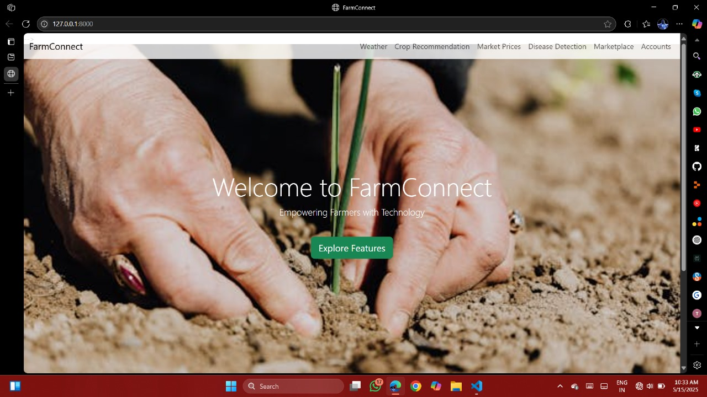
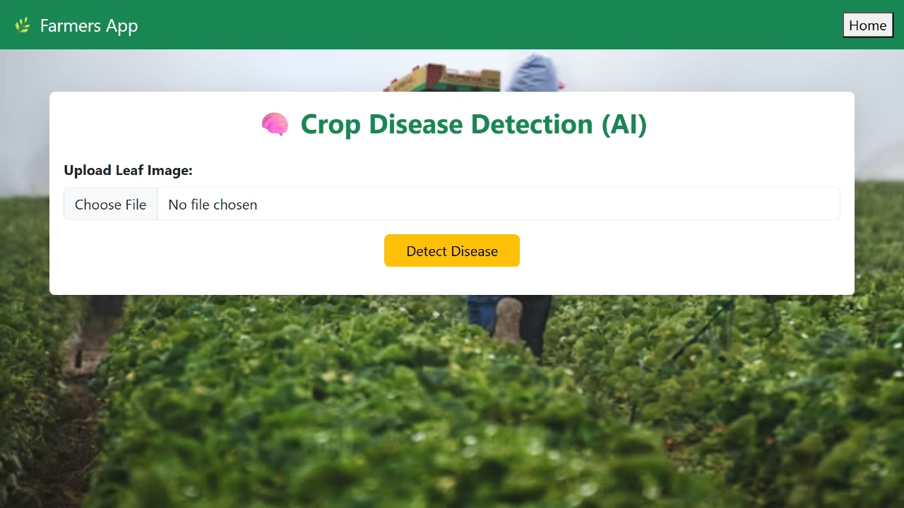
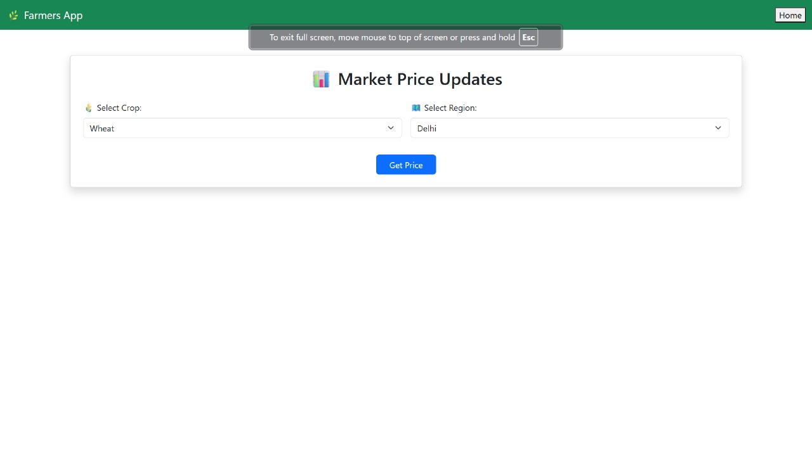
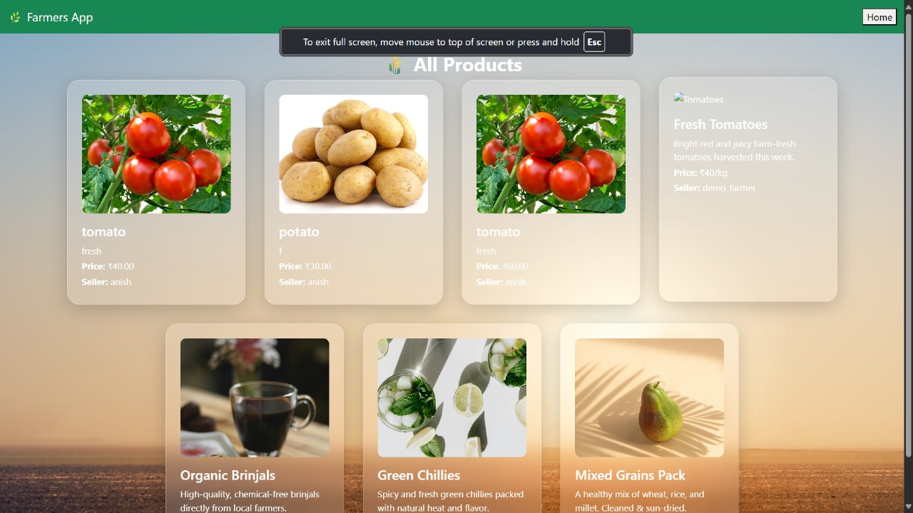

# 🌾 Farmers Assistant App

The **Farmers Assistant App** is a Django-based web application designed to empower farmers with smart tools for agriculture. It provides real-time weather updates, crop recommendations based on soil and climate data, market price trends, AI-based crop disease detection, and an online marketplace to connect farmers directly with buyers.

---

## 🚀 Features

1. **🌤️ Weather Forecasting**
   - Real-time weather alerts: temperature, rainfall, humidity, etc.

2. **🌱 Crop Recommendation System**
   - Suggests the best crops to grow based on soil type and climate.

3. **📈 Market Price Updates**
   - Shows current market prices of various crops for better decision-making.

4. **🧠 Crop Disease Detection**
   - AI-powered disease identification from uploaded crop images.

5. **🛒 Online Marketplace**
   - Farmers can list products and connect directly with buyers.
   - Buyers can search, filter, and order fresh produce.

6. **👥 User Authentication**
   - Separate profiles for Farmers and Buyers.
   - Secure login and registration.

7. **📩 Contact and Order Requests**
   - Buyers can directly contact sellers or place orders.

8. **📍 Location-Based Services**
   - Optional future integration with GPS for hyperlocal insights.

9. **🔔 Email/SMS Alerts**
   - Notifies users about weather changes and orders (optional integration).

10. **📰 Farming Tips & News Feed**
    - Share articles, videos, and expert tips with rural farmers.

---

## 🛠️ Technologies Used

- **Frontend**: HTML, CSS, Bootstrap, JavaScript
- **Backend**: Python, Django
- **Database**: SQLite (for development), can be migrated to MySQL/PostgreSQL
- **AI/ML**: TensorFlow / Scikit-learn for disease detection and crop recommendation
- **APIs**: OpenWeather API for weather data
- **Version Control**: Git & GitHub

---

## 🖼️ Screenshots
**Home Page:**  


**crop_recommendation:**  


**disease_detection:**  


**market_price:**  


**products:**  



You can view screenshots of the project inside the[Project_View](./farmers_app/project_view/)
.folder.

---

## 🔧 How to Run Locally

### 1. Clone the repository
```bash
git clone https://github.com/your-username/farmers-assistant-app.git
cd farmers-assistant-app
